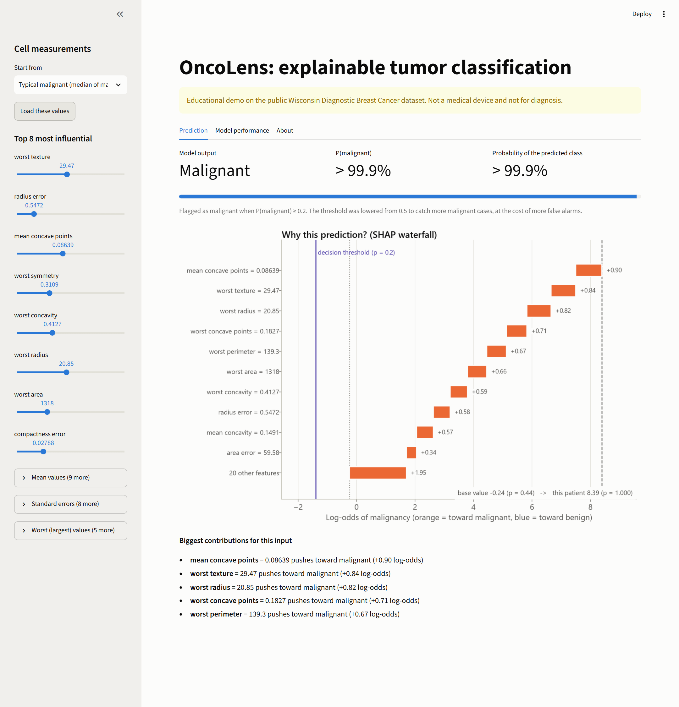
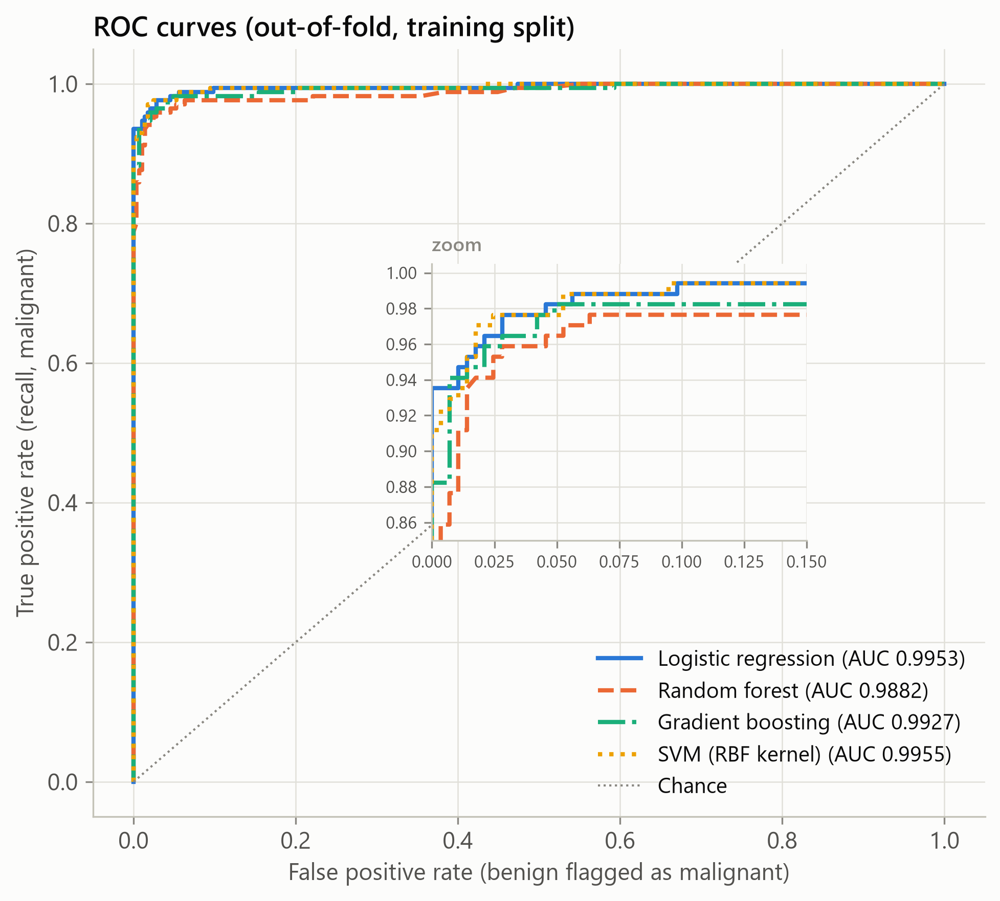
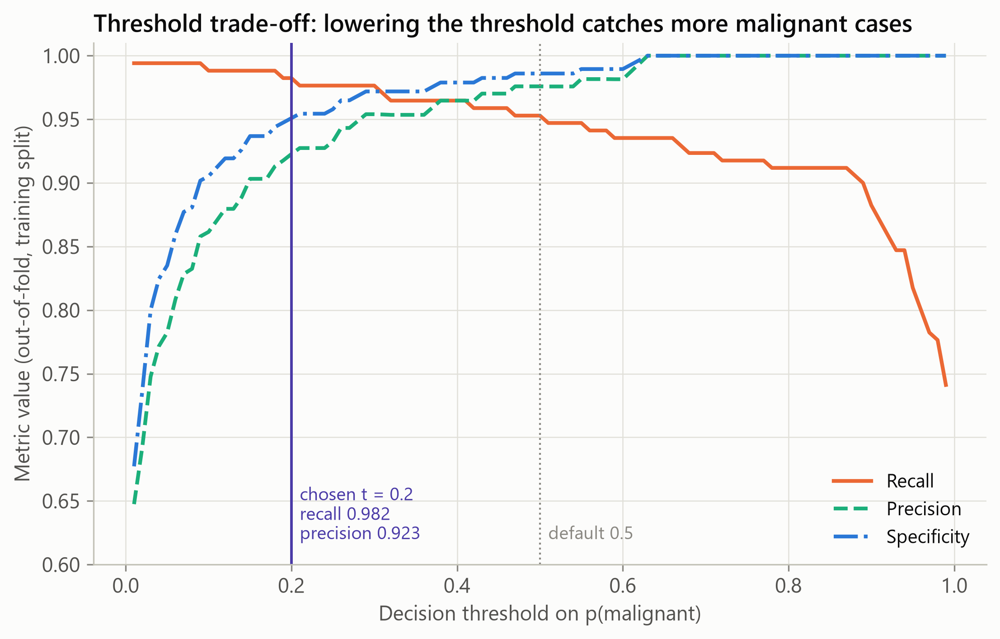
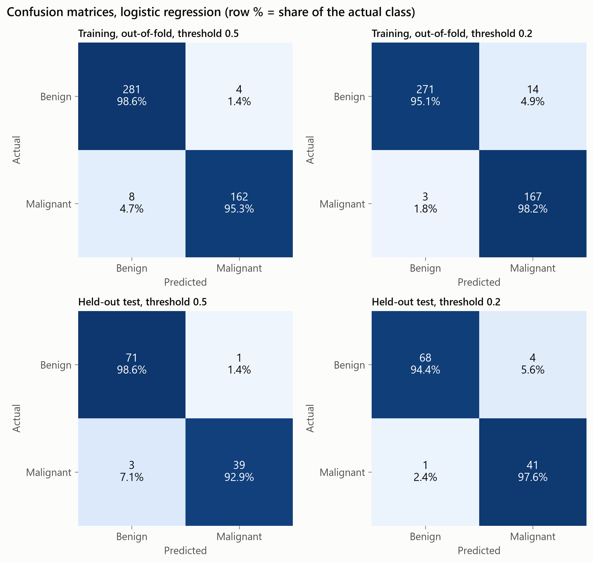
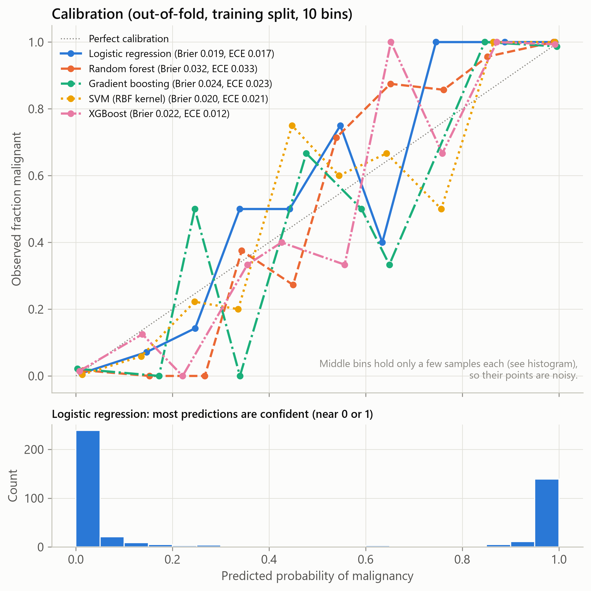
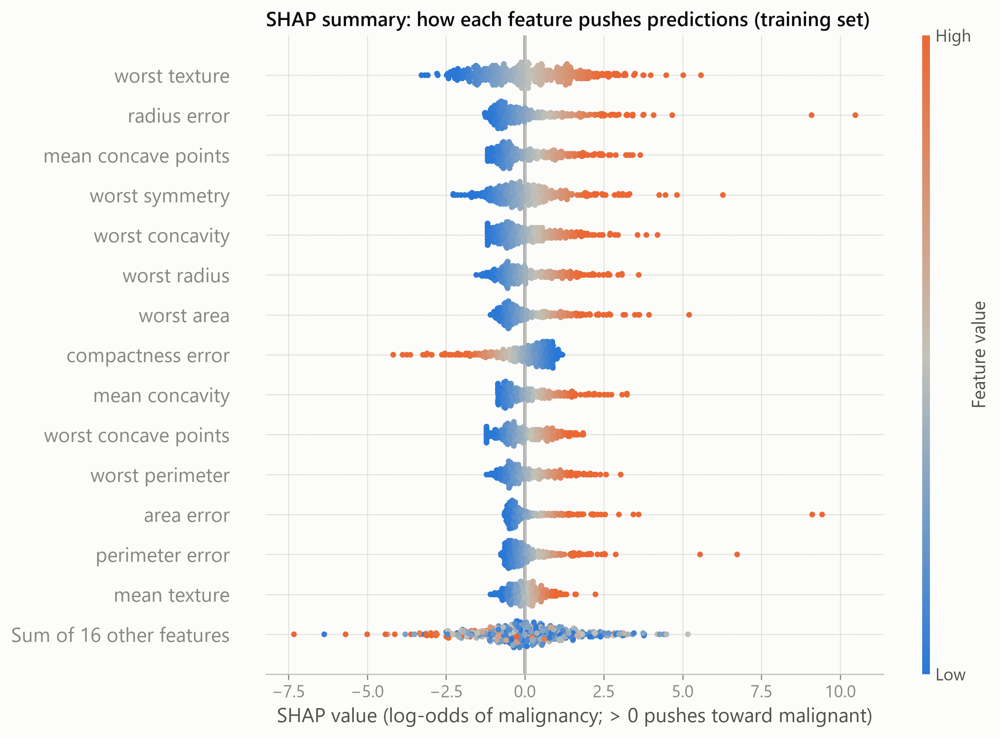
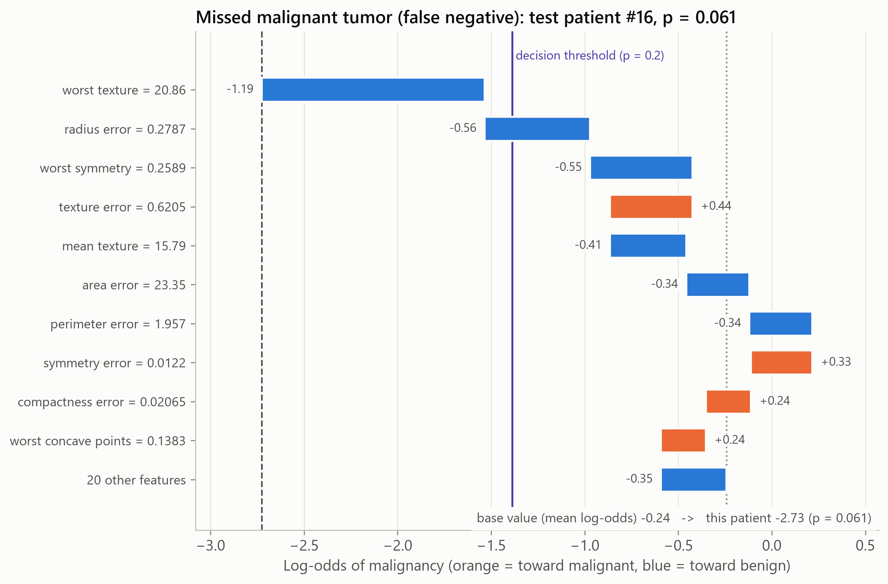
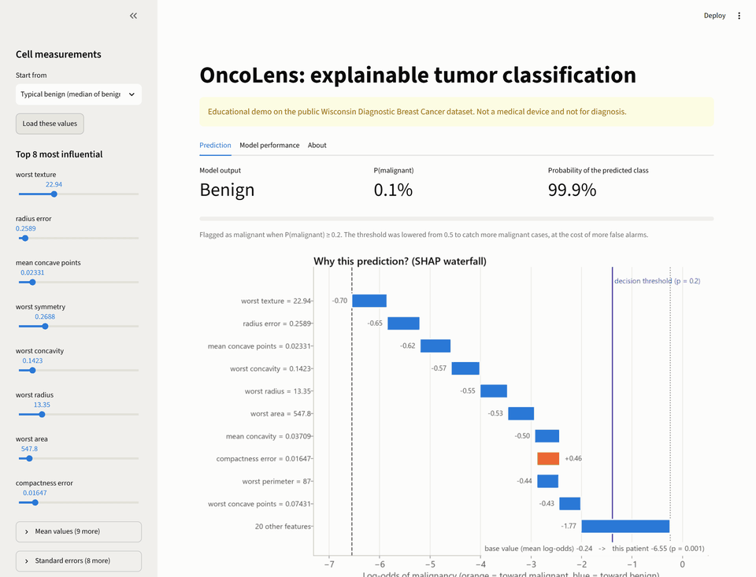
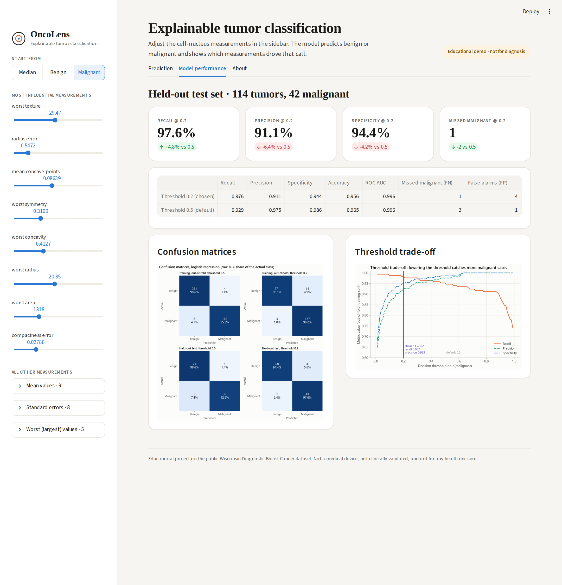
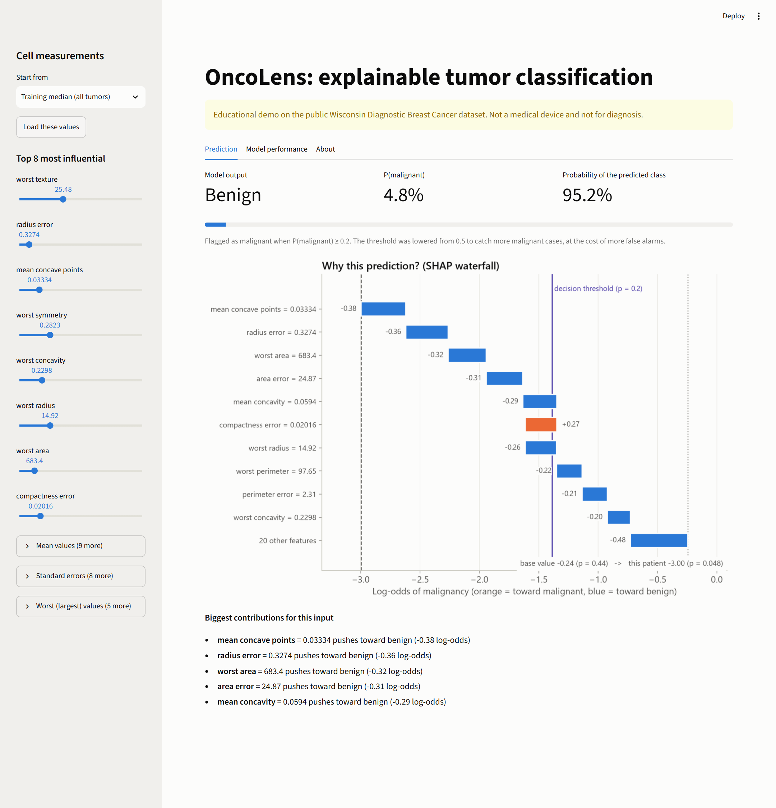

# OncoLens: Explainable Tumor Classification Dashboard

An end-to-end, reproducible machine-learning project on the public **Wisconsin Diagnostic Breast Cancer**
dataset (bundled with scikit-learn). It compares five classifiers with leakage-safe cross-validation,
picks a decision threshold that favors catching malignant cases, explains every prediction with SHAP,
studies the mistakes, and ships an interactive Streamlit app.

> **Educational project only.** This is not a medical device, has not been clinically validated, and
> must not be used to make any health decision. See [Limitations](#limitations).



## Highlights

- **5 models compared** (logistic regression, random forest, gradient boosting, RBF SVM, XGBoost) with stratified
  5-fold CV, tuned with `GridSearchCV`, and ranked by **nested CV** so the tuning does not inflate scores.
- **No data leakage:** scaling happens inside every CV pipeline; a 20% test set is held out and used exactly once.
- **Recall-first threshold:** the decision threshold was lowered from 0.5 to **0.2** using only
  out-of-fold training predictions. On the held-out test set this cut missed malignant cases from 3 to 1
  (out of 42), at the cost of 3 extra false alarms.
- **Explainability:** exact SHAP values (linear explainer) for global importance and per-patient waterfalls,
  also computed live in the app for whatever the user enters.
- **Error analysis:** misclassified tumors are compared feature by feature with correctly classified ones.
- **Reproducible:** one command rebuilds every number and figure; 48 pytest tests; a script that verifies
  the project from a fresh clone and a fresh virtual environment.

## Results

All numbers below are generated from `results/` by `scripts/08_summary_tables.py`, and a test checks that
this README matches them exactly.

<!-- results:start -->
**Model comparison** (training split, 455 samples, stratified 5-fold CV, mean ± std across folds):

| Model | ROC AUC (tuned, nested CV) | Recall at 0.5 | Accuracy at 0.5 | Brier | ROC AUC (default settings) |
|---|---|---|---|---|---|
| **Logistic regression** (chosen) | 0.9949 ± 0.0051 | 0.9353 ± 0.0432 | 0.9714 ± 0.0149 | 0.0232 | 0.9958 ± 0.0047 |
| Random forest | 0.9863 ± 0.0075 | 0.9412 ± 0.0372 | 0.9582 ± 0.0162 | 0.0351 | 0.9880 ± 0.0073 |
| Gradient boosting | 0.9914 ± 0.0057 | 0.9353 ± 0.0343 | 0.9648 ± 0.0162 | 0.0251 | 0.9908 ± 0.0054 |
| SVM (RBF kernel) | 0.9938 ± 0.0067 | 0.9471 ± 0.0432 | 0.9670 ± 0.0098 | 0.0217 | 0.9949 ± 0.0050 |
| XGBoost | 0.9936 ± 0.0037 | 0.9529 ± 0.0235 | 0.9758 ± 0.0082 | 0.0224 | 0.9942 ± 0.0039 |

**Held-out test set** (114 samples, 42 malignant, used once), logistic regression:

| Threshold | Recall (malignant) | Precision | Specificity | Accuracy | ROC AUC | Missed malignant (FN) | False alarms (FP) |
|---|---|---|---|---|---|---|---|
| 0.5 (default) | 0.929 (39/42) | 0.975 | 0.986 | 0.965 | 0.996 | 3 | 1 |
| 0.2 (chosen) | 0.976 (41/42) | 0.911 | 0.944 | 0.956 | 0.996 | 1 | 4 |
<!-- results:end -->

How to read this:

- All five models are close (ROC AUC 0.986 to 0.995). The differences between the top four are smaller than
  the fold-to-fold standard deviation, so the choice of **logistic regression** rests on it scoring highest
  *and* being the simplest to explain, not on a decisive win.
- Accuracy goes *down* slightly at threshold 0.2. That is intended: the threshold trades a few false alarms
  for fewer missed cancers.
- With only 42 malignant test cases, one tumor is 2.4 percentage points of recall. Treat the test numbers
  as a sanity check, not a precise estimate.

## Figures

| | |
|---|---|
|  |  |
|  |  |
|  |  |

All 18 figures (300 dpi, colorblind-safe palette) are in [`figures/`](figures/) with one-sentence captions in
[`figures/CAPTIONS.md`](figures/CAPTIONS.md): class balance, correlation heatmap, PCA scatter, feature
distributions, CV comparison, ROC and precision-recall curves, calibration, threshold trade-off, confusion
matrices, learning curve, SHAP importance, beeswarm, four patient waterfalls, and the error profile.

## Method

1. **Data** (`scripts/01_data.py`): 569 samples, 30 numeric features describing cell nuclei in a
   digitized fine-needle aspirate image, 212 malignant / 357 benign. The label is re-coded so
   **1 = malignant** (the class we want to catch). Validation checks: expected shape, no missing values,
   no negative measurements, no duplicate rows. Stratified 80/20 split (seed 42): 455 train, 114 test.
2. **Baseline** (`02_baseline.py`): standardize + logistic regression in one `Pipeline`, stratified 5-fold CV.
3. **Model comparison and tuning** (`03_model_selection.py`): each model gets a small, conventional
   `GridSearchCV` grid scored by ROC AUC. To compare *tuned* models fairly, the whole grid search is run
   inside each outer fold (nested CV). The model with the highest nested-CV ROC AUC is chosen
   (logistic regression, `C = 1.0`). The rule was fixed before looking at results: prefer logistic regression
   if it is within 0.005 of the best; it won outright, so the rule was not needed.
4. **Calibration** (`04_calibration_threshold.py`): out-of-fold probabilities for the training split give an
   honest reliability curve. Logistic regression had the lowest out-of-fold Brier score of the tuned models
   (0.019). Its expected calibration error (0.017, 10 bins) was below the pre-set 0.05 limit (XGBoost's was
   lower still, 0.012), so no recalibration was added.
5. **Threshold selection** (same script): among thresholds 0.01 to 0.99, pick the **highest** one whose
   out-of-fold recall is at least 0.98. Result: 0.20. On the training folds this changed the outcome from
   8 missed / 4 false alarms (at 0.5) to 3 missed / 14 false alarms (at 0.2).
6. **Final test** (`05_final_test.py`): the chosen model and threshold are applied to the untouched test set once.
7. **SHAP** (`06_explain_errors.py`): exact `LinearExplainer` values in log-odds, with the training split as
   background. The contributions of one patient add up exactly to the model's output (verified in the tests).
   The most influential features on average are worst texture, radius error, and mean concave points.
8. **Error analysis** (same script): the 17 out-of-fold training errors and 5 test errors are compared with
   correctly classified tumors. Summary in [`results/error_analysis.md`](results/error_analysis.md).
9. **Figures and tables** (`07_figures.py`, `08_summary_tables.py`).

### What the errors look like

- Out-of-fold on the training split: 3 missed malignant tumors and 14 false alarms at threshold 0.2.
- On the top 8 SHAP features, both error groups sit **between** the class averages. On a scale where
  0 = average correctly classified benign tumor and 1 = average correctly classified malignant tumor, the
  median position is 0.29 for missed cancers and 0.38 for false alarms.
- Size tells the story: false alarms are larger than typical benign tumors (mean worst radius 16.22 vs 13.27)
  and missed cancers are smaller than typical malignant ones (15.79 vs 21.38).
- The one malignant test tumor that was missed (test row 16, p = 0.061) had a low worst texture value that
  pulled it strongly toward benign ([waterfall](figures/14_shap_waterfall_missed_malignant_1.png)).
- 47% of the training errors had a probability within 0.15 of the threshold, so many mistakes are borderline
  calls, but not all of them.

## The app

```bash
streamlit run app.py
```



- 30 sliders (the 8 most influential up front, the rest grouped as mean / standard error / worst values),
  with ranges taken from the training data, plus presets such as "typical benign" and "typical malignant".
- Output: the predicted class at threshold 0.2, P(malignant), and the probability of the predicted class.
- A SHAP waterfall and a plain-language list of the biggest contributions for **the current input**.
- A "Model performance" tab with the held-out test metrics and figures.

| Performance tab | Benign example |
|---|---|
|  |  |

## How to run

Requires Python 3.12 or newer (the pinned numpy and shap versions need it). Developed and verified on Python 3.14.5, Windows 11.

```bash
python -m venv .venv
# Windows: .venv\Scripts\activate      macOS/Linux: source .venv/bin/activate
pip install -r requirements.txt        # pinned versions; also installs this package in editable mode

python run_all.py --clean --tests      # rebuild all data, results, figures (~1 min), then run tests
streamlit run app.py                   # open http://localhost:8501
```

Other commands:

```bash
pytest -q                              # tests only
bash scripts/check_fresh_env.sh        # clone -> new venv -> clean run -> tests -> compare results
pip install -r requirements-dev.txt
python scripts/capture_screenshots.py --gif  # regenerate app screenshots + docs/demo.gif (uses your installed Chrome)
```

The dataset ships with scikit-learn, so nothing is downloaded. A CSV copy is cached in `data/` on the first
run, and everything works offline after that.

## Project structure

```
app.py                     Streamlit app
run_all.py                 runs scripts/01..08 in order (--clean, --tests)
src/oncolens/              the package
  config.py                paths, seed, split size, target recall
  data.py                  load, validate, cache, split
  models.py                pipelines (scaler + model) and grids
  selection.py             default CV, nested CV, GridSearchCV, selection rule
  metrics.py  calibration.py  threshold.py
  explain.py               SHAP explainer for a pipeline
  errors.py                error-analysis helpers
  style.py  plots_eda.py  plots_model.py  plots_shap.py
  app_support.py           app logic kept testable outside Streamlit
scripts/                   one script per pipeline step + screenshot and fresh-env tools
tests/                     pytest suite
data/  results/  figures/  cached data, metrics (CSV/JSON/MD), figures
docs/screenshots/          app screenshots
```

## Limitations

- **Not clinical.** Educational use only. No clinical validation, no regulatory review, no clinician input.
  The model must not be used to diagnose or rule out cancer.
- **Small, old, single-source dataset.** 569 samples from one institution, collected in the early 1990s.
  Performance on other hospitals, imaging equipment, or patient populations is unknown and could be much worse.
- **Pre-computed features.** The inputs are summary statistics that someone first extracted from a
  digitized image. The project does not work on raw images, and its accuracy depends on that upstream step.
- **Small test set.** 114 test samples (42 malignant). One misclassification moves recall by 2.4 points.
  Confidence intervals would be wide.
- **Threshold choice is a value judgment.** 0.98 target recall was picked to illustrate the trade-off, not set
  by clinicians. The real costs of false negatives and false positives are not modeled.
- **SHAP explains the model, not biology.** Many features are strongly correlated (radius, perimeter, area),
  so the linear model splits credit between them in ways that can look odd (for example, a higher
  compactness error *lowers* the predicted risk). A SHAP value is not a causal effect.
- **Slider inputs can be unrealistic.** Sliders move independently, so the app accepts combinations that
  never occur in real tumors (e.g. large radius with small area). Predictions for such inputs mean little.

## Acknowledgements

Dataset: W. H. Wolberg, W. N. Street, O. L. Mangasarian, *Breast Cancer Wisconsin (Diagnostic)*,
UCI Machine Learning Repository (CC BY 4.0), as distributed with scikit-learn.

Additional project notes: [`DECISIONS.md`](DECISIONS.md) (every judgment call and why),
[`PROGRESS.md`](PROGRESS.md) (handoff status), [`INTERVIEW_PREP.md`](INTERVIEW_PREP.md).
